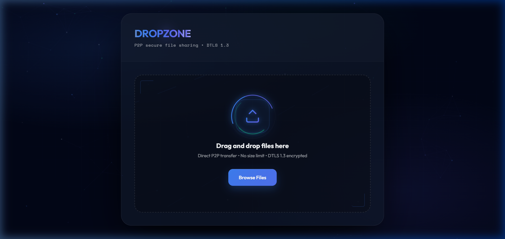
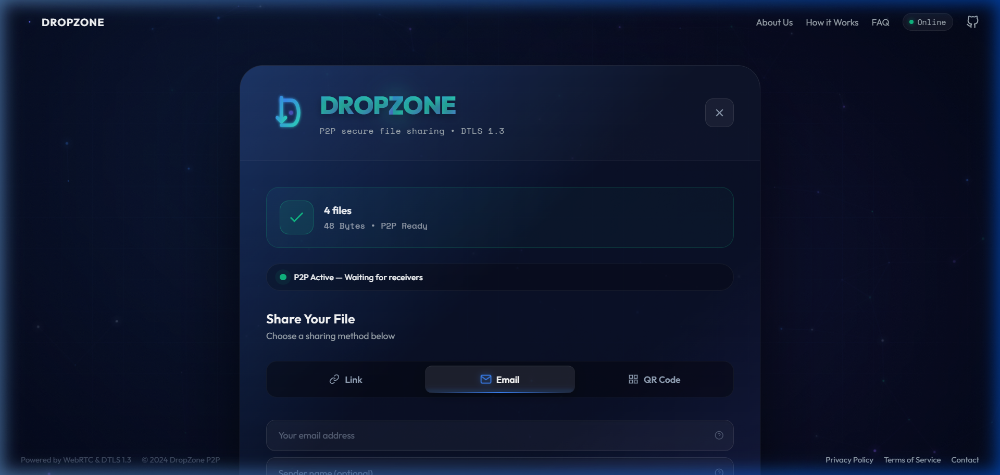
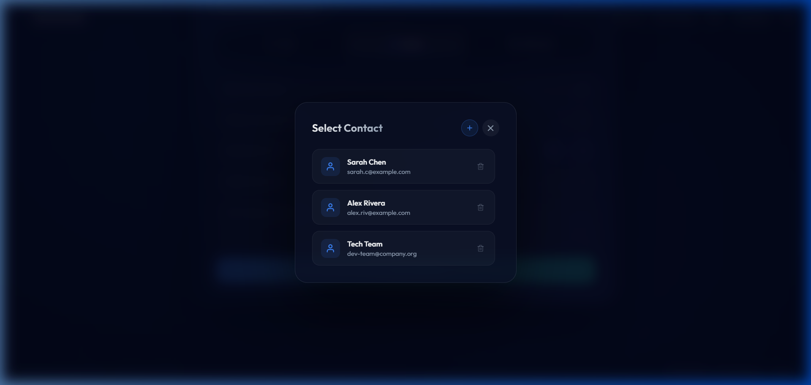
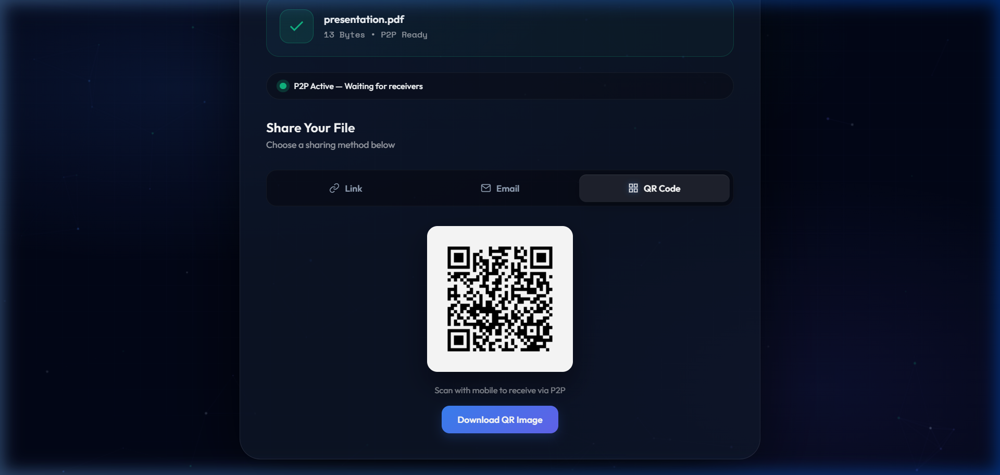
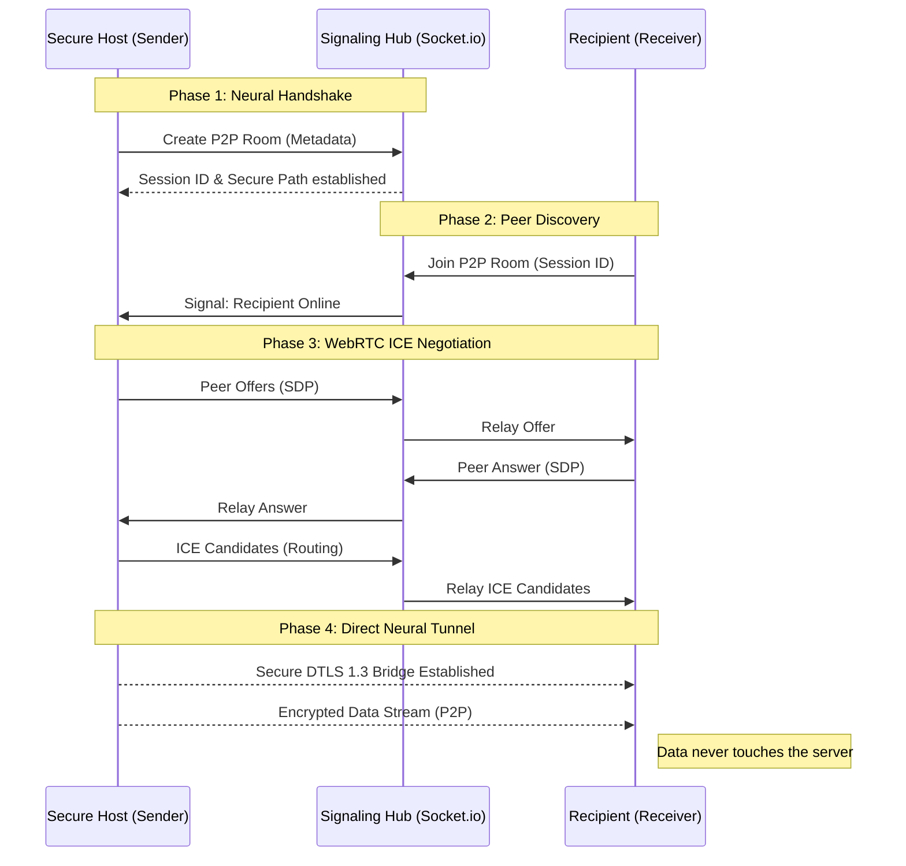

# 🌌 DROPZONE

### **Direct Peer-to-Peer File Sharing | Reinvented for the Modern Web**

[](https://webrtc.org/)
[](https://en.wikipedia.org/wiki/Datagram_Transport_Layer_Security)
[](https://developer.mozilla.org/en-US/docs/Web/JavaScript)
[](https://opensource.org/licenses/MIT)

**DropZone** is a high-performance, browser-based file-sharing application that bypasses traditional server-side bottlenecks. Built on the cutting edge of **WebRTC** and **DTLS 1.3**, it enables direct, encrypted transfers without ever storing your data in the cloud.

---

## 📺 Website Preview

<div align="center">
  
  
  <br>
  
  
</div>

> [!TIP]
> **View the Interactive Recording**: [Click here to view the full UI walkthrough](./assets/preview.webp)

---

## ✨ Features

### 🚀 **Next-Gen P2P Engine**
- **Direct Transfers**: Send files directly between browsers. No server upload limits, no storage delays.
- **Smart Backpressure**: 16KB chunking and intelligent buffer management to prevent memory overflow.
- **Multi-File Support**: Transfer batches of files with real-time progress for each.

### 🔒 **Security First**
- **DTLS 1.3 Encryption**: Negotiated via browser for maximum security.
- **Zero-Storage**: Files never touch the server disk; the server only facilitates signaling.
- **ECDSA Handshake**: Secure identity verification for every P2P session.

### 🎨 **Premium Aesthetic & UX**
- **Glassmorphism UI**: Stunning semi-transparent interface with deep blurs and sharp accents.
- **Dynamic Animations**: Canvas particles, 3D card tilt, and physics-based icon interactions.
- **Quick Pick Modal**: Sophisticated contact management for rapid recipient selection.
- **Unified Sharing**: Instant QR codes and professional HTML email invitations.

---

## 🏗️ Neural Architecture

DropZone operates on a dual-phase **Neural P2P Protocol**, segregating discovery from data transmission to ensure maximum security and speed.



---

## 🛠️ Technology Stack

| Layer | Technology | Purpose |
| :--- | :--- | :--- |
| **P2P Engine** | WebRTC (DataChannel) | Low-latency direct binary transfer |
| **Security** | DTLS 1.3 & ECDSA | Industry-standard encryption & auth |
| **Frontend** | Vanilla ES6+ & CSS3 | Cinematic Glassmorphism UI |
| **Signaling** | Socket.io (Node.js) | Real-time Peer Discovery |
| **Visuals** | Canvas API & Inline SVG | Neural Auras & Adaptive Diagrams |

---

## 🚦 Installation & Setup

1. **Clone & Install**
   ```bash
   git clone https://github.com/pranav662/DropZone.git
   cd DropZone
   npm install
   ```

2. **Configure Environment**
   Rename `.env.example` to `.env` to enable email invitations:
   ```env
   PORT=3000
   SMTP_HOST=smtp.gmail.com
   SMTP_USER=your-email@gmail.com
   SMTP_PASS=your-app-password
   ```

3. **Launch**
   ```bash
   npm start
   ```

---

## 🤝 Contributing
We welcome contributions! Please feel free to open issues or submit pull requests to help evolve the Neural P2P ecosystem.

## 📄 License
Released under the [MIT License](LICENSE).

---

<p align="center">
  Built with ❤️ for a faster, more independent, and secure web.
</p>
